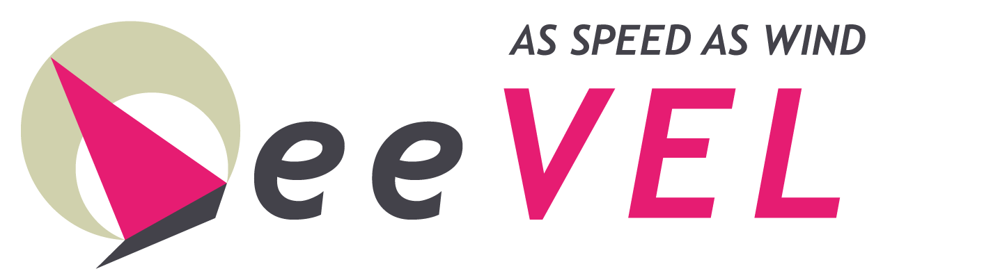

<p align="center">
  <a href="https://github.com/hunzhiwange/queryphp/releases">
    </a>
  <a href="https://travis-ci.org/hunzhiwange/queryphp">
    </a>
  <a href="https://secure.php.net/">
    </a>
  <a href="http://opensource.org/licenses/MIT">
    </a>
</p>

# The Leevel Framework To Rebuild QueryPHP

Leevel is an open source web framework delivered as a C extension and supplement for the QueryPHP framework providing high performance and lower resource consumption.

## Requirement

```
version_compare(PHP_VERSION, '7.1.3', '<') && die('PHP 7.1.3 OR Higher');
```

## How to install

### Windows

Need to tests.

### Linux 

You can download the source code.

```
git clone git@github.com:hunzhiwange/leevel.git
cd ext
```


Then compile it.

```
$/path/to/phpize
$./configure --with-php-config=/path/to/php-config
$make && make install
```

Then add extension to your php.ini,you can see if installation is successful by command php -m.

```
extension = leevel.so
```

## Official Documentation

Documentation for the framework can be found on the [Leevel website](http://www.queryphp.com).

## License

The Leevel framework is open-sourced software licensed under the [MIT license](http://opensource.org/licenses/MIT).
